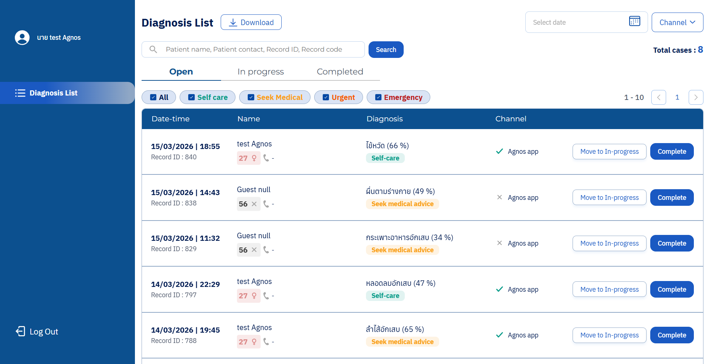

# Agnos Dashboard AI

    Agnos AI ช่วยให้ผู้ใช้สามรถตรวจสอบอาการและรับการวินิจฉัยเบื้องต้นได้ ข้อมูลของผู้ใช้จะเชื่อมโยงกับแดชบอร์ด AI เพื่อให้เจ้าหน้าที่โรงพยาบาลตรวจสอบและติดต่อได้หากจำเป็น

1. สิ่งที่ต้องมีในเครื่อง
   - Chrome: Version 146.0.7680.80
   - Chrome Driver: Version 146.0.7680.80
   - Python: Version 3.14.2

2. Test Stack/Tools
   - Framework:
     - Robot Framework: Version 7.4.1
   - Library:
     - Selenium Library: Version 6.8.0

3. Test Setup&Installation
   1. Download Python: [Python](https://www.python.org/downloads/)

      \* เมื่อติดตั้งแล้ว หากใช้ไม่ได้ ต้องดำเนินการตั้งค่า Path

   2. Install Robot Framework:
      - เปิด Terminal/cmd
      - คำสั่ง pip install robotframework
   3. Install Selenium Library:
      - เปิด Terminal/cmd
      - คำสั่ง pip install robotframework-seleniumlibrary
   4. Download Browser Chrome: [Chrome](https://www.google.com/intl/th_th/chrome/)
   5. Download Browser Chrome Driver:
      - เช็ก Version Browser Chrome
      - Download: [Chrome Driver](https://googlechromelabs.github.io/chrome-for-testing/)

4. How to Run Tests
   - Register Page:

     _TERMINAL:_ ../Automate_Testing/RegisterPage

     คำสั่ง: robot Register_Testcase.robot

   - Log in Page:

     _TERMINAL:_ ../Automate_Testing/LoginPage

     คำสั่ง: robot Login_Testcase.robot

   - Dashboard Page:

     _TERMINAL:_ ../Automate_Testing/DashboardPage

     คำสั่ง: robot Dashboard_Testcase.robot

5. Test Scope
   - Register Page
   - Log in Page
   - Dashboard Page

6. Report
   - Link Test Case: [Test Case](https://docs.google.com/spreadsheets/d/1TrGr5bM2sEAm6OVEPAGaBJIs1gFemfJTiLwt6Xca-z4/edit?usp=sharing)
   - report.html:

     _TERMINAL คำสั่ง:_ start report.html

   - log.html:

     _TERMINAL คำสั่ง::_ start log.html

7. GitHub
   - Link: [GitHub](https://github.com/Rawee-ss/Agnos_SoftwareTester_Candidate.git)
